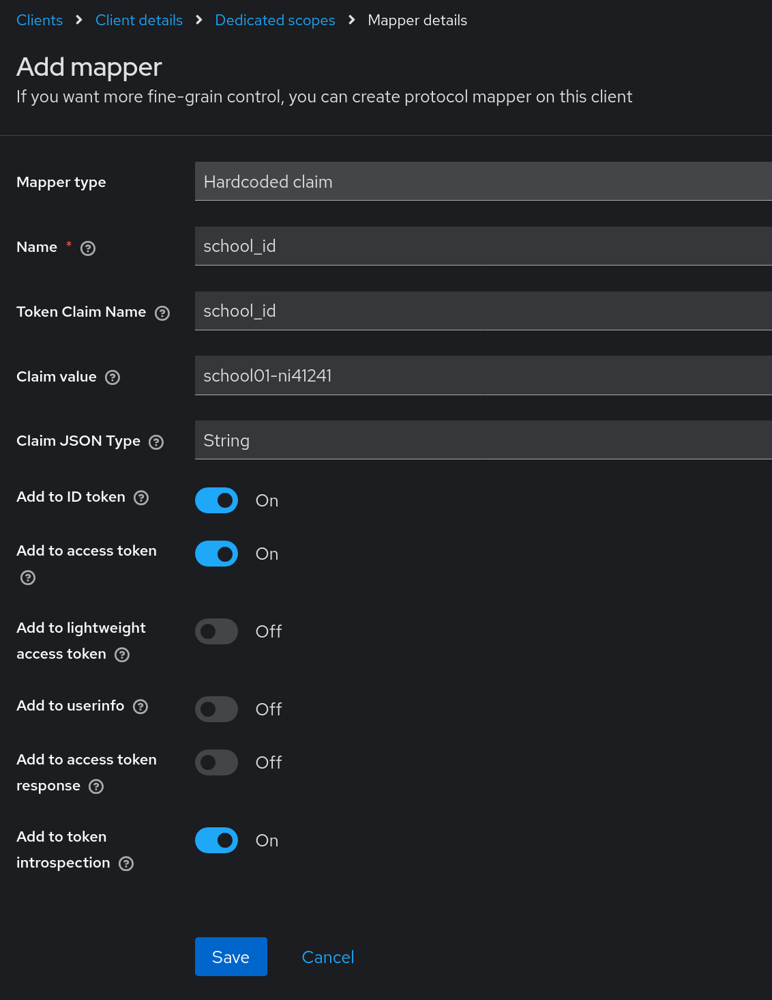

# Configuring an OIDC Client for connecting to BILDUNGSLOGIN

This is an example of how to prepare a client for the OIDC- Connection to BILDUNGSLOGIN via a Keycloak™- IdP Server.
This document is intended as a starting point, not a conclusive How-To. There will be variations in most cases, specifically in regards to the provision of a user- and school- id.

## Table of Contents

- [Adding a client](#adding-a-client)
  - [Set General, Access- Settings](#set-general-access--settings)
  - [Configure Capability- Settings](#configure-capability--settings)
  - [Adjust Logout- Settings (optional)](#adjust-logout--settings-optional)
  - [Find the Client- Secret](#find-the-client--secret)
- [Configure Scopes](#configure-scopes)
  - [Client Scopes](#client-scopes)
  - [Add mappers](#add-mappers)
    - [Set the school_id](#set-the-school_id)
    - [Set the user_id](#set-the-user_id)
    - [Disallow other scopes](#disallow-other-scopes)
- [Configure Advanced Settings](#configure-advanced-settings)

## Adding a client

Log in to your admin- console, and create a new client.

### Set General, Access- Settings
- name your client, and add a description
- consult with BILDUNGSLOGIN to retrieve the correct redirect- URI's

### Configure Capability- Settings

In the capability config:
- ensure _Client authentication_ is enabled
- ensure (only) _Standard flow_ is enabled

### Adjust Logout- Settings (optional)

Usually it is not desired to log the user out of your IdP, if the user logs out of BILDUNGSLOGIN- Services.

If you do wish this scenario, enable the Backchannel- Settings accordingly

### Find the Client- Secret

In the onboarding- process, you will need to pass the Client- Secret to BILDUNGSLOGIN - here's where you find it:

## Configure Scopes

### Client Scopes
Navigate to the _Client scopes_ Tab and clean up the transmitted scopes.

### Add mappers
Navigate into the "-dedicated" - Section of the Client- Scope section...

...and select "Configure new mapper":

#### Set the school_id and school_name
BILDUNGSLOGIN requires a school_id to be transmitted with the user- login. This can originate from a _Hardcoded claim_ (as shown here), a _User Attribute_, or another source, which is configured here to transmit.

In the example below, the school-id is set to the value "school01-ni41241"

Optionally repeat this with _school\_name_

#### Set the user_id
BILDUNGSLOGIN requires a persistent user- id for each user. If you cannot or don't want to use a standard value like _sub_ or _preferred\_username_, you can set this value from another user- attribute as follows:

#### Disallow other scopes
You probably won't need to transmit other scopes, hence you can restrict the usage of them accordingly.

## Configure Advanced Settings
Navigate to the _Advanced_ Tab...

...and set the usage of the PKCE- Method with SHA256 to be required:

Save your settings accordingly.