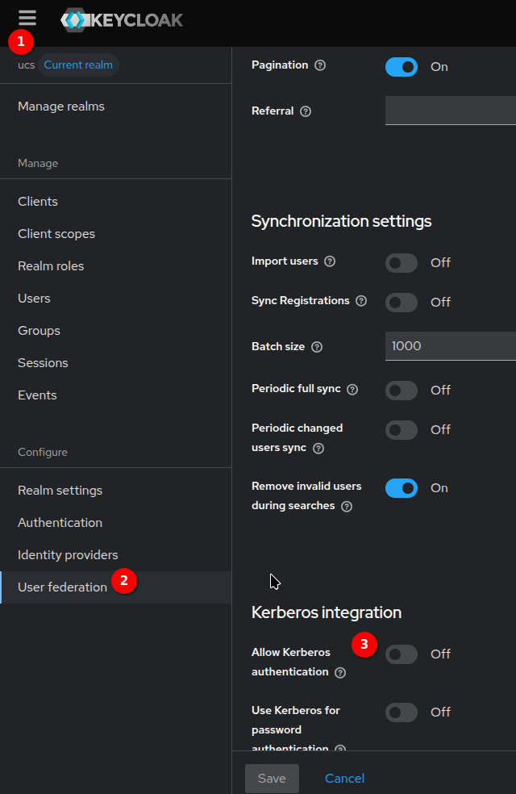

# Deaktivierung Kerberos- Authentifizierung

Um die Kerberos-Authentifizierung in Keycloak zu deaktivieren, führen Sie die folgende Schritte durch:

- Wählen Sie die "ucs" Realm aus und navigieren zu "User federation"

- Deaktivieren Sie "Allow Kerberos Authentication" und speichern Sie die Änderungen