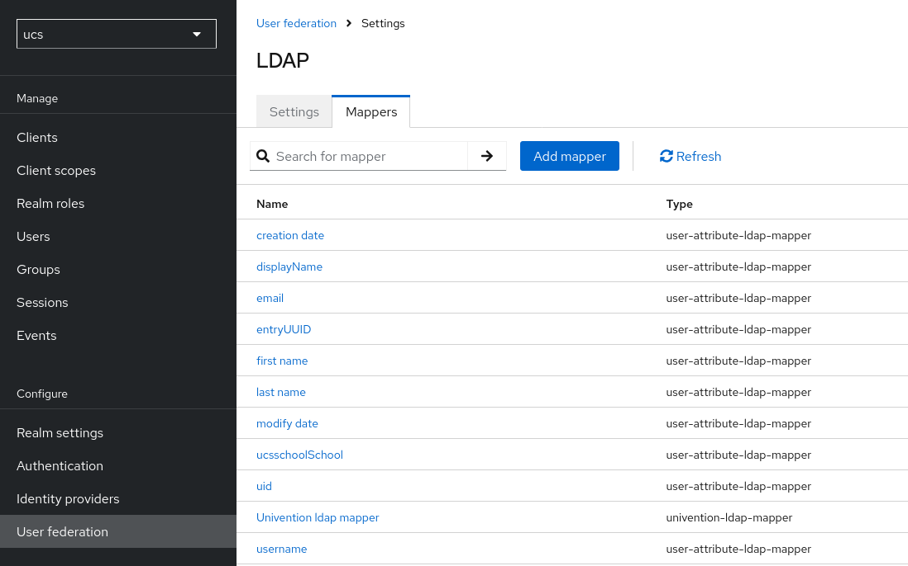
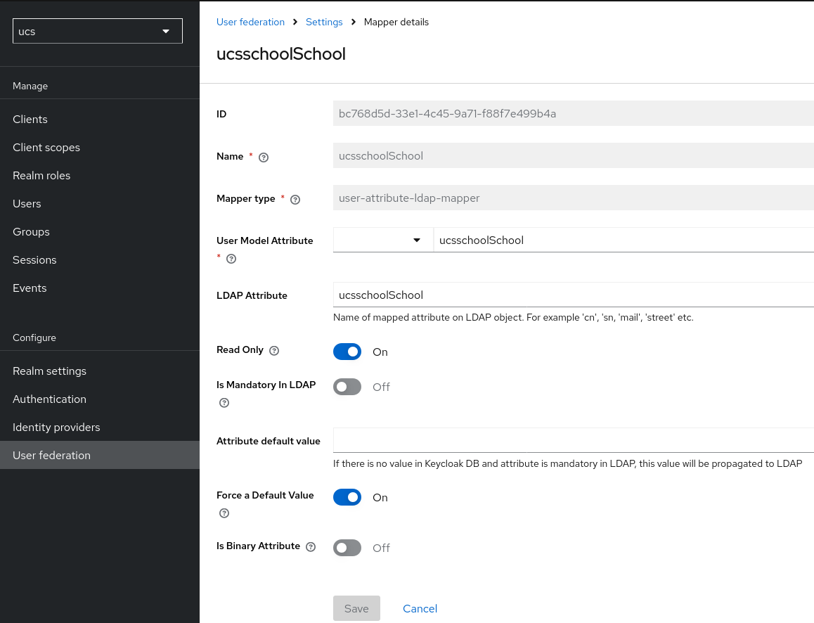
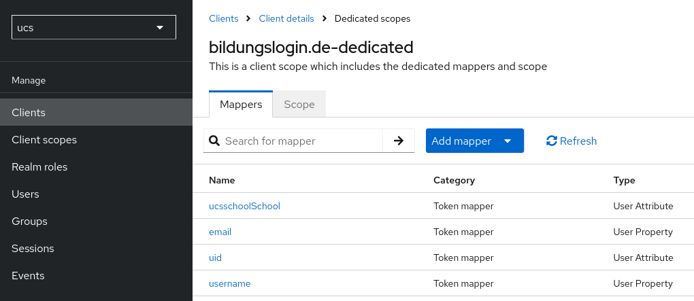
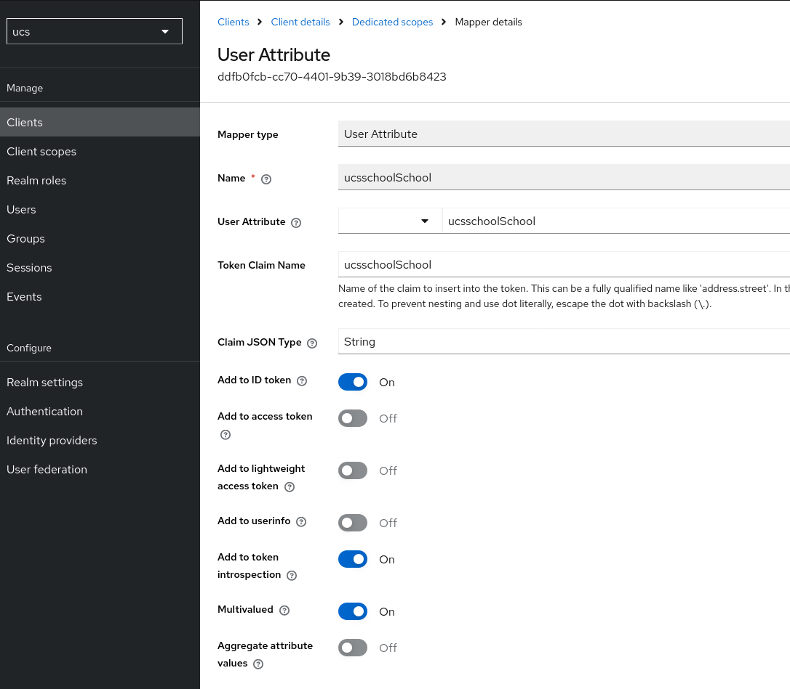
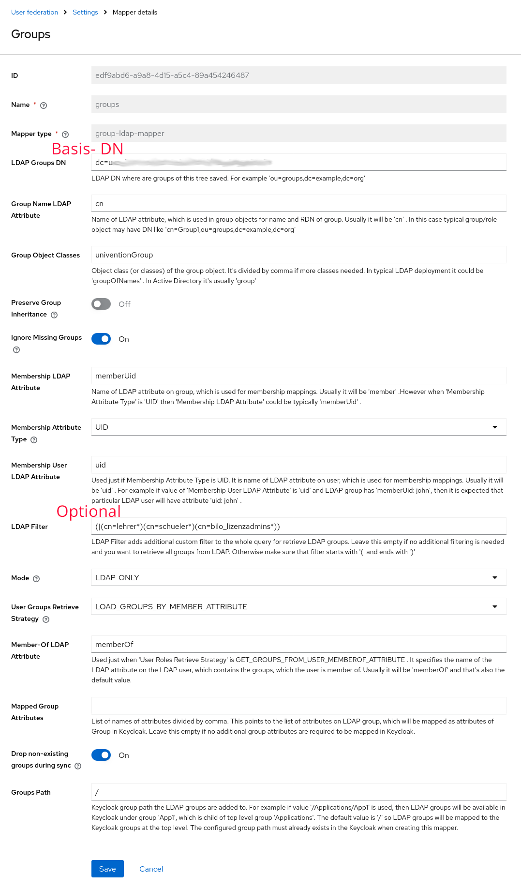

# Migration von BILDUNGSLOGIN auf das UCS-Keycloak- Plugin

## Zusätzliche Claims

Zusätzlich zum UCS- Attribut "username" (übertragen im Claim "preferred_username" aller Tokenkategorien) müssen die Attribute "ucsschoolSchool", sowie "ucsschoolGroups" vom UCS- System übertragen werden.
Hierzu navigieren Sie zur Keycloak-App Ihres UCS- Systems und melden sich mit Administrator- Rechten an.

### Hinzufügen des Claims ucsschoolSchool

#### Erstellung des LDAP- Mappers
- Wählen Sie die "ucs" Realm aus und navigieren zu "User federation"

- Erstellen Sie einen neuen Mapper ("Add mapper") vom Typ user-attribute-ldap-mapper, mit dem Namen ucsschoolSchool
Setzen Sie als "User Model Attribute" sowie "LDAP Attribute" den Namen ucsschoolSchool, und wählen weiterhin "Read Only" und "Force a Default Value" an - und speichern Sie die Änderungen

#### Konfiguration des Clients

- Navigieren Sie zu "Clients" und wählen Sie den bereits für BILDUNGSLOGIN erstellten Client aus - hier beispielhaft: "bildungslogin.de"
- Klicken Sie auf den Tab "Client Scopes", und navigieren zu den dedizierten Scopes (hier: "bildungslogin.de-dedicated", wobei bildungslogin.de dem Client- Namen entspricht)

- Fügen Sie mit "Add mapper" einen neuen Claim "By configuration" hinzu
- Wählen Sie "User Attribute" als Typ des Mappers aus
- Setzen Sie als "Name", "User Attribute" sowie "Token Claim Name" jeweils ucsSchoolSchool
- Setzen Sie ausschließlich den ID Token als übermittelnden sowie die "token introspection", und setzen Sie die "Multivalued"- Option

- Speichern Sie den Mapper

### Hinzufügen des Claims ucsschoolGroups

#### Erstellung des LDAP- Mappers
Gegebenenfalls ist die Synchonisation der Gruppen bereits konfiguriert, sodass die Gruppenzugehörigkeit bereits übertragen wird. In diesem Fall können Sie zum nächsten Schritt springen.

- Erstellen Sie einen neuen Mapper ("Add mapper") vom Typ group-ldap-mapper, mit dem Namen groups (siehe auch [UCS- Hinweise](https://docs.software-univention.de/keycloak-app/latest/configuration.html#map-udm-groups-to-keycloak) )

    **Optional** können Sie den Mapper auch auf die Gruppenfilterung anpassen, um nur bestimmte Gruppen zu übertragen. Um ausschliesslich UCS@School- relevante Gruppen zu übermitteln (relevant fuer den Lizenzmanager) ist ein solcher: `(|(cn=lehrer*)(cn=schueler*)(cn=bilo_lizenzadmins*))`
    **Achtung:** Dies empfiehlt sich ausschließlich, wenn Sie die Gruppenzugehörigkeit in keinen anderen Clients benötigen.
    
- Nachdem Sie den Mapper gespeichert haben, öffnen Sie den Mapper nochmals, und klicken oben Rechts bei "Action", und wählen "Sync LDAP groups to Keycloak" aus. Nach einigen Momenten wird ein Status angezeigt, Sie sind nun mit der Anlage fertig.

#### Konfiguration des Clients

- Navigieren Sie zu "Clients" und wählen Sie den bereits für BILDUNGSLOGIN erstellten Client aus - hier beispielhaft: "bildungslogin.de"
- Klicken Sie auf den Tab "Client Scopes", und navigieren zu den dedizierten Scopes (hier: "bildungslogin.de-dedicated", wobei bildungslogin.de dem Client- Namen entspricht)
- Fügen Sie mit "Add mapper" einen neuen Claim "By configuration" hinzu
- Wählen Sie "Group Membership" als Typ des Mappers aus
- Setzen Sie als "Name" sowie "Token Claim Name" jeweils ucsschoolGroups
- Setzen Sie ausschließlich den ID Token und Userinfo als übermittelnden sowie die "token introspection"

